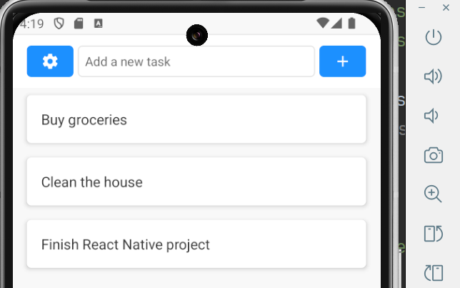
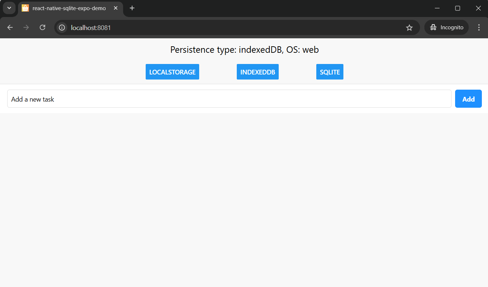

# React Native Expo Demo

React Native Expo app showcasing SQLite integration, database migrations, and web support with AsyncStorage and IndexedDB. 
Includes integration tests and a multi-platform demo (Android & web).

# Chapters
## 1. Database migrations and integration testing
I made first version of the app to showcase how you can to database migrations 
and configure integration tests to be run in a Node.js environment.
Read more about it in my blog post on [expo sqlite migrations and integration testing](https://www.amarjanica.com/bridging-the-gap-between-expo-sqlite-and-node-js/)
or [watch my YT tutorial](https://youtu.be/5OBi4JtlGfY).  
[Codebase](https://github.com/amarjanica/react-native-sqlite-expo-demo/tree/98c355d5b1fa065a5ec6585273232908edfe50ec)

## 2. Web support with SQLite, AsyncStorage and IndexedDB
I've added web support to the app, so it can run on the web. You can dynamically switch between
different storage types: SQLite, AsyncStorage and IndexedDB. SQLite is supported on the web via
[sql.js](https://github.com/sql-js/sql.js/).
Read more about it in my blog post on [expo sqlite, indexeddb and asyncstorage on the web](https://www.amarjanica.com/expo-sqlite-on-the-web-localstorage-indexeddb-and-sql-js/)
or [watch my YT tutorial](https://youtu.be/JZYXtOgqEbc).  
[Codebase](https://github.com/amarjanica/react-native-sqlite-expo-demo/tree/5dd4a2d046073127a1d9f82e7ebd54c1c1b98f7b)

## 3. Redux
I've integrated Redux into the app to manage global state more efficiently.
Read more about it in my blog post on [redux integration in expo router app](https://www.amarjanica.com/building-a-redux-powered-app-with-expo-sdk-51/)
or [watch my YT tutorial](https://youtu.be/Ez6E6M9yYP8).  
[Codebase](https://github.com/amarjanica/react-native-sqlite-expo-demo/tree/4f472835c33250c5f90a8f44a160bcc55336f4cb)

## 4. Incrementing Expo App Version with release please
Example process of incrementing the app version with `release-please` and `semantic-release`.
Read more about it in my blog post on [incrementing expo app version with release please](https://www.amarjanica.com/automate-expo-app-versioning-with-github-and-release-please/)
or [watch my YT tutorial](https://youtu.be/wN6cd9cd4qc).  
[Codebase](https://github.com/amarjanica/react-native-sqlite-expo-demo/tree/e9f07ad2e04524e76583b183f4b2a1a2569508ba)

## 5. Publish to Play from GitHub Actions
Updated Release Please with publish to Play Internal Test Track, after release please bumps expo version.
Added a [separate manual dispatch workflow](.github/workflows/release-dev.yaml) that builds development apk and publishes it to GitHub releases.
Read more about it in my blog post on [publishing expo to play](https://www.amarjanica.com/publish-expo-app-to-google-play-with-github-actions/)
or [watch my YT tutorial](https://youtu.be/sGjJxSBZMTA).  
[Codebase](https://github.com/amarjanica/react-native-sqlite-expo-demo/tree/5592b948acf113613cc7adb5fa4c3f607e1577e0)

## 6. Publish to TestFlight from GitHub Actions
Updated Release Please with [publish to testflight](.github/workflows/release-please.yml#L52). Added a [separate manual dispatch workflow](.github/workflows/release-ipa.yml) that releases IPA file to TestFlight.
Read more about it in my blog post on [publishing to testflight from github](https://www.amarjanica.com/submit-expo-ios-app-to-apple-appstore/)
or [watch my YT tutorial](https://youtu.be/wUvtS8CWhMs).  
[Codebase](https://github.com/amarjanica/react-native-sqlite-expo-demo/tree/7ac72eb7904448aac7b6e56982e833dee38e1f89)

## 7. Making SQLite work on the web with sql.js and indexeddb
In my previous tutorials I already made SQLite work on the web with sql.js.
I also showed you how to use AsyncStorage and IndexedDB on the web.
But I didn't show you how to make SQLite persistable between sessions with the help of IndexedDB.
Read more about it in [making sqlite work on the web](https://www.amarjanica.com/making-sqlite-work-on-the-web-with-sql-js-and-indexeddb-2/)
or [watch my YT tutorial](https://youtu.be/mUq0yUTJQ6Y).  

## 8. Import and export SQLite web and native
Added import and export database to native and web part.  
Read more about it in [how to import & export sqlite](https://www.amarjanica.com/import-and-export-sqlite-database-in-expo-native-and-web/).
or [watch my YT tutorial](https://youtu.be/56VQxU_kgwE).  
[Codebase](https://github.com/amarjanica/react-native-sqlite-expo-demo/tree/079f354ad03012e173a708efacc55e9888564f80)


# App Screenshot
<p align="center">

</p>

# Run it on Android
I've tested this demo natively on android emulator.
```sh
npm i
# runs on expo go
npm run go:android
# or run on expo dev client
npm run dev:android
```

# Web App Screenshot
<p align="center">
  
</p>

# Run it on the web
```sh
npm i
npm run web
```

# Tests
Tests don't need an emulator. They're just `jest` tests that you can run with `npm test` like any nodejs project.
